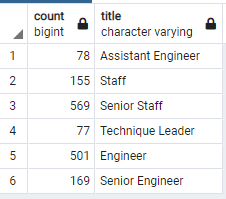
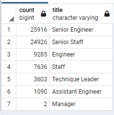

# Pewlett-Hackard-Analysis

## Overview
### Purpose
The purpose of this analysis is to use SQL to determine how many employees are retiring and sorting them by title. Additionally, eligible employees to participate in the mentorship program are identified.

In general, the analysis will be used to answer the following questions:
1. Who will be retiring within the next few years?
2. How many positions will need to be filled?

## Results
### Employees retiring by title
Firstly, a table of all employees retiring is created. This table included the employee number, first name, last name, title, and start and end date. This table is then sorted further to create a unique titles table, which includes the employee number, first name, last name, and title. This table only includes current employees and their most recent title. From this unique title table, the count by title can be generaged. From this table, the following results are generated:

- (Title, Count)
- Senior Engineer, 25916
- Senior Staff, 24926
- Engineer, 9285
- Staff, 7636
- Technique Leader, 3603
- Assistant Engineer, 1090
- Manager, 2

### Mentorship Eligibility 
Secondly, a mentorship eligibility table is created. This table is created by finding employees born during the year 1965 and showing their information through their employee number, first name, last name, birth date, from date, to date, and title. 

Furthermore, a small table summarizing the count of eligible employees for mentorship by title was created for analysis purposes, which can be viewed below in the Summary section.

### Major Conclusions
- Many Senior Engineers and Senior Staff employees are retiring 
- Only a few managers are retiring
- From the mentor eligibility summary table, there are quite a few Senior engineers and Senior staff employees eligible for mentorship, however not nearly enough to replace all of those who are retiring
- There are NO managers eligible for mentorship

## Summary
### Additional Resources
Answering the questions proposed in the Overview will use the following additional Queries/charts:

Total number of employees eligible for retirement:
SELECT SUM(count) FROM retiring_titles

Number of employees eligible for retirement by title:

Count of employees eligible for mentorship by title:
SELECT COUNT(emp_no), title FROM mentorship_eligibility
GROUP BY title;

### Addressing Questions
1. Who will be retiring within the next few years?
Those retiring includes Senior Engineers, Senior Staff, Engineers, Staff, Technique Leaders, Assistant Engineers, and Managers. Most of those retiring will be Senior Engineers and Senior Staff.

2. How many positions will need to be filled?
There is 72458 positions which will need to be filled, majority being Senior Engineers (25916) and Senior Staff (24926).